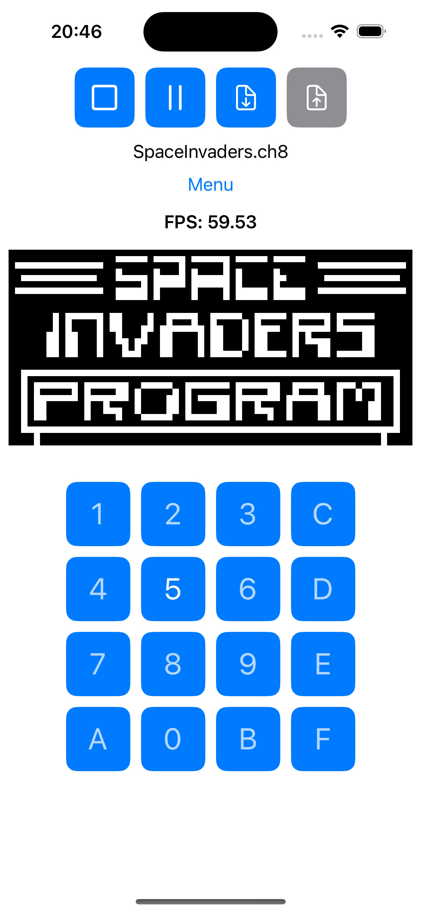
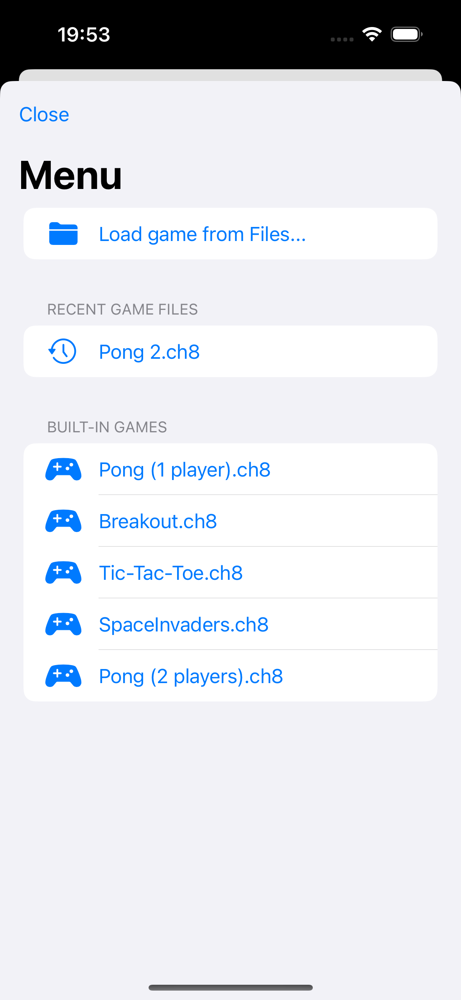
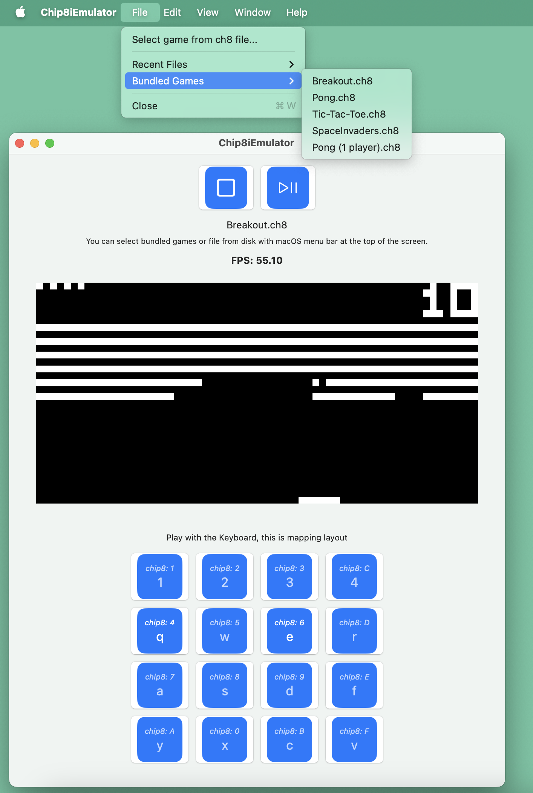

# Chip8iEmulationFrontend

This is a frontend example usage of the **Chip8iEmulationCore** Swift package. It provides a SwiftUI interface for running a Chip8 emulation core on **macOS** and **iOS**.

For more information about the **Chip8iEmulationCore** visit https://github.com/danijelLoc/Chip8iEmulationCore

## Features

- **Play/Stop, Pause/Resume**: Control emulation state easily.
- **Sound Support**: Sound effects on game events.
- **Keyboard Input (macOS)**: Play using keyboard controls on macOS.
- **Touch Input (iOS)**: On-screen touch controls for easy gameplay on iOS.
- **Bundled Games**: Preloaded Chip8 ROMs for quick fun.
- **File Selection (macOS & iOS)**: Load external ROMs from system storage.
- **Save** and **Load** emulation **state**.

## Screenshots

### iOS

    
    

### macOS

> Note: If targeting macOS, run "Chip8iEmulator Prod" scheme to get full speed gamec emulation from Xcode, without need to archive to .app package.

## Building project from source

1. Clone the repository.
2. Build and run on macOS or iOS targets using Xcode.
 
## Notes

- This project **only provides the frontend**. The core emulation logic is handled by the **Chip8iEmulationCore** Swift package.

